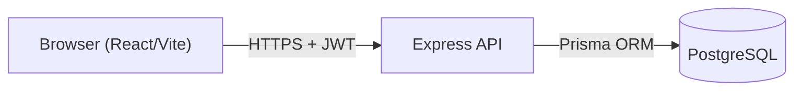

## Architecture

This document describes the high-level architecture of PumpApp / PumpPro.

### Monorepo layout

```text
PumpApp/
├── apps/
│   ├── web/          # React + Vite + TS, shadcn/ui, TanStack Table, RHF, Zod
│   └── api/          # Express + TS + Prisma
├── packages/
│   └── shared/       # Shared enums, DTOs, Zod validation schemas
├── db/               # Prisma schema, migrations, seed
├── docs/             # Product & technical docs
├── package.json      # Root workspace + scripts
├── pnpm-workspace.yaml
└── tsconfig.base.json
```

- **apps/web**: Frontend SPA responsible for UI, routing, forms, and data display.
- **apps/api**: Backend REST API implementing business rules and data access.
- **packages/shared**: TypeScript library shared between `web` and `api` (types, enums, Zod schemas).
- **db**: Prisma schema and migrations for a single PostgreSQL database.

### Runtime architecture



- The **frontend** talks only to the **Express API** via REST + JSON.
- The **API** uses Prisma as the only way to access the PostgreSQL database.
- Business rules (pricing history, reconciliation, role checks, etc.) live in API services, not in the UI.

### Authentication & authorization

- **Auth** is handled with **JWT** access tokens.
- Only `SYSTEM_USER` accounts can log in.
- Roles (`ADMIN`, `USER`, `SALE`, `PUMPIST`) are enforced via middleware.
- Sensitive operations (e.g. managing users, prices, reconciliation) are restricted to `ADMIN`.

### Database overview

See `docs/DATABASE.md` for details. At a high level:

- **Users & workers**: `User`, `Worker`.
- **Merchandise**: `Category`, `Product`, `PurchasePriceHistory`.
- **Fuel**: A separate subdomain from shop products: `FuelType`, `Tank`, `FuelDelivery`, `Pump` (optional `tankId`), `FuelPriceHistory`, `PumpReading`. See `docs/FUEL-TRACKING.md` for tanks, deliveries, and theoretical vs actual quantity.
- **Operations**: `Shift`, `ShiftWorker`, `CashHandIn`, `ShiftReconciliationSummary`.
- **Shop sales**: `ShopSale`, `ShopSaleItem` (Phase 2).
- **Costs**: `FixedCost`.

### Shift-centric design

- All operational data is grouped **by shift**:
  - workers on duty (`ShiftWorker`),
  - pump readings for that shift (`PumpReading`),
  - cash handed in (`CashHandIn`),
  - reconciliation summary (`ShiftReconciliationSummary`).
- Daily, weekly, and monthly reports are **queries/aggregations** over shifts, not separate stored summaries.
- **Operational cadence** (e.g. daily cash collection vs weekly physical shop counts) is documented in `docs/OPERATIONS.md`.

### Fuel revenue computation

- Fuel volume: `closingReading - openingReading` for each `PumpReading`.
- Fuel price: looked up in `FuelPriceHistory` by date (effectiveFrom/effectiveTo).
- Fuel revenue per pump per shift: `volume × pricePerUnit`.
- Shift-level fuel revenue: sum of per-pump revenues.

### Shop sales capture (phased)

- **Phase 1**: Owner/admin enters **shift-end shop sales total**; no requirement for per-transaction capture.
- **Phase 2**: System supports per-transaction `ShopSale` + `ShopSaleItem` and stock updates.
- `ShiftReconciliationSummary` always records which source was used (see `docs/DOMAIN-DECISIONS.md`).

### Error handling & validation

- All external inputs (API requests) are validated via Zod schemas (`packages/shared`).
- The API returns consistent error payloads, hiding internal stack traces.
- Money-sensitive operations (reconciliation, price updates) fail loudly when validation fails.

### Auditability principles

- Historical data is **append-only** where important (e.g. `PurchasePriceHistory`, `FuelPriceHistory`).
- Reconciliation summaries and pump readings are never hard-deleted.
- Admin overrides (e.g. fuel revenue, cash total on reconciliation summary) must carry reasons and are clearly marked in the data model or `notes` (see `docs/DOMAIN-DECISIONS.md`).
